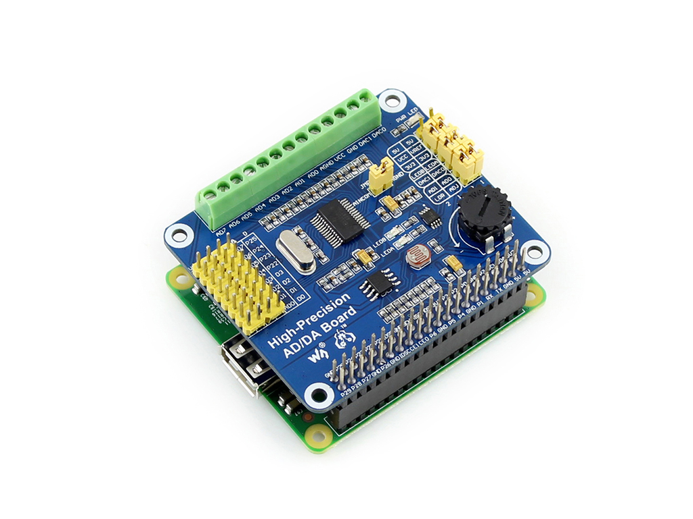

# High-Precision AD/DA Board
## waveshare electronics

http://www.waveshare.net  
https://www.waveshare.com  

## 中文 ## 
http://www.waveshare.net/shop/High-Precision-AD-DA-Board.htm  
我是块Raspberry Pi A+/B+/2B/3B/3B+的扩展板，具备8通道24位高精度ADC和2通道16位高精度DAC。
Raspberry Pi GPIO接口没有AD/DA功能，如果你要用到高精度的AD/DA，那我将是不错的选择！

注意：
上传的仅为树莓派驱动程序。

## English ## 
https://www.waveshare.com/high-precision-ad-da-board.htm  
I am a Raspberry Pi A+/B+/2B/3B/3B+ expansion board with an 8-channel 24-bit high-precision ADC and a 2-channel 16-bit high-precision DAC.
The Raspberry Pi GPIO interface does not have AD/DA functionality. If you want to use high precision AD/DA, then I will be a good choice!

note:
Uploaded only for the Raspberry Pi driver.

